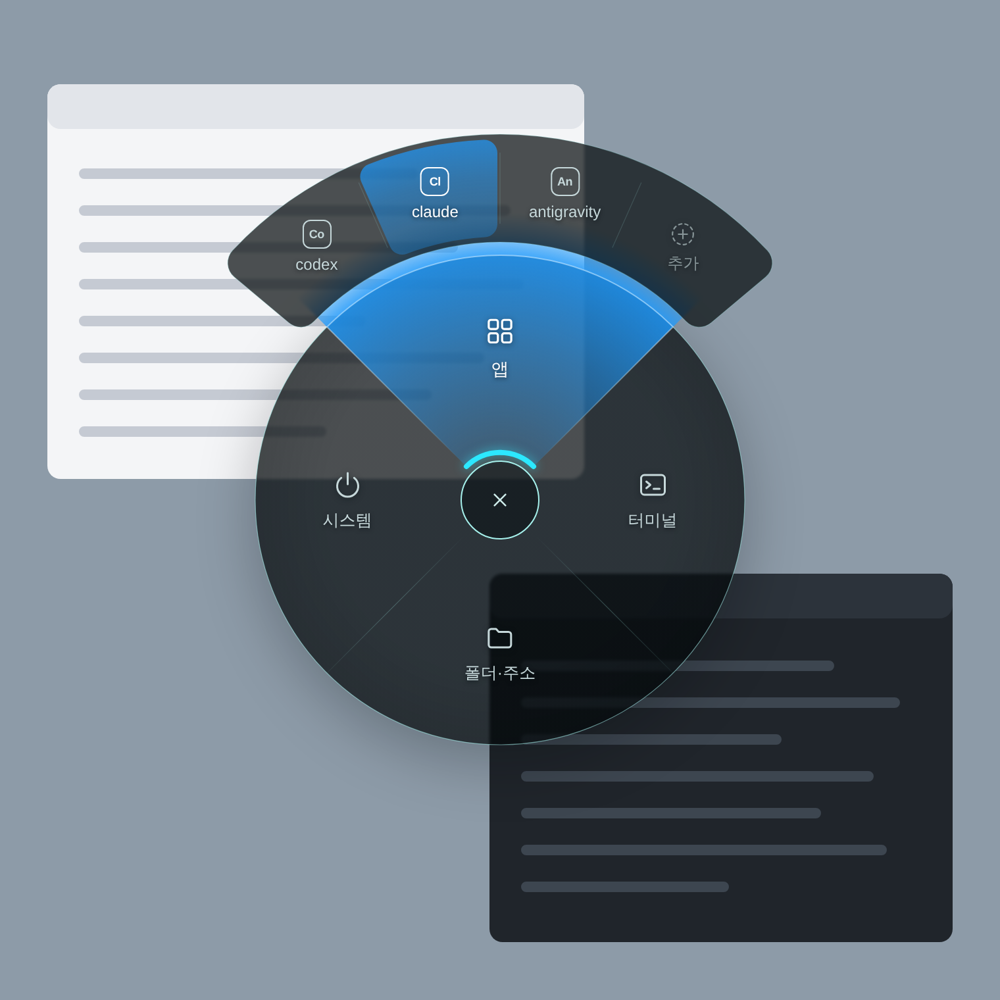

# Radial Menu

Windows용 2단 원형(radial) 런처 & 단축 메뉴 앱입니다.  
**`Ctrl` + 마우스 휠클릭** 한 번으로 커서가 있는 위치에 바로 메뉴를 띄우고 빠르게 프로그램을 실행할 수 있습니다.

  

---

## 🕹️ 사용 방법 (조작법)

1. **메뉴 열기**: 화면 어디서나 **`Ctrl` 키를 누른 상태에서 마우스 휠클릭**을 합니다. (현재 마우스 커서 위치에 원형 메뉴가 나타납니다)
2. **항목 가리키기**: `Ctrl` 키를 누른 채로 마우스를 원하는 방향으로 움직여 **상위 분류(앱/터미널/폴더/시스템)**와 **세부 항목**을 조준합니다.
3. **실행**: 가리킨 상태에서 **`Ctrl` 키를 떼면** 해당 항목이 즉시 실행됩니다.
   * *취소하려면?* 중심의 `✕` 영역에 마우스를 올리거나 `Esc` 키를 누르면 아무것도 실행하지 않고 닫힙니다.

---

## ✨ 주요 특징

- **2단 원형 레이아웃**: 내측 4대 기본 분류(앱 / 터미널 / 폴더·주소 / 시스템) 및 외측 세부 항목 슬롯
- **마우스 커서 중심 즉시 호출**: 마우스 이동 거리를 최소화하는 직관적인 원형 계기판 HUD 디자인
- **자유로운 항목 편집**: 화면에서 직접 항목을 추가·수정하거나, 자동화 에이전트가 `rmctl` CLI로 간편하게 설정
- **관리자 권한 안전 상주**: 관리자 창(작업 관리자, 관리자 터미널 등) 위에서도 정상 작동하며, 일반 프로그램은 안전하게 권한을 낮춰 실행

---

## 🛠️ 기술 스택 및 문서

- **스택**: Tauri 2 (Rust 백엔드 + WebView2) + TypeScript / Vite
- **설계 문서**: [docs/](docs/README.md)
  - [아키텍처](docs/architecture.md)
  - [입력 & 인터랙션](docs/interaction.md)
  - [설정 (menu.json)](docs/configuration.md)
  - [권한 & 보안](docs/elevation-and-security.md)
- **디자인 핸드오프**: [UI_designs/](UI_designs/HANDOFF.md)
