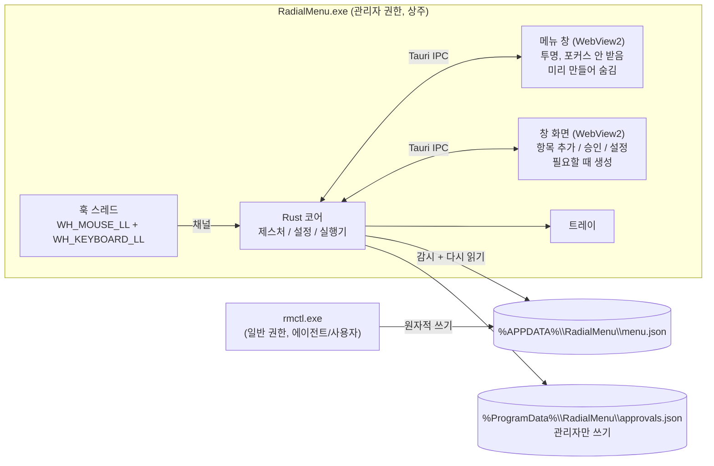
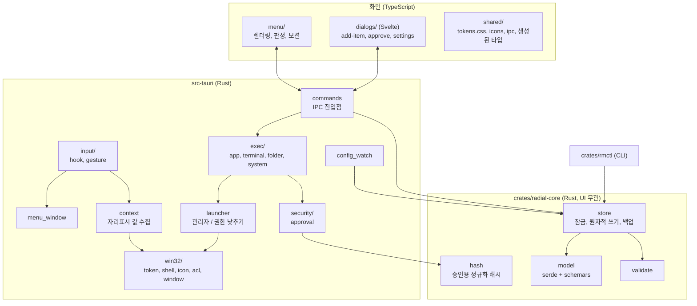
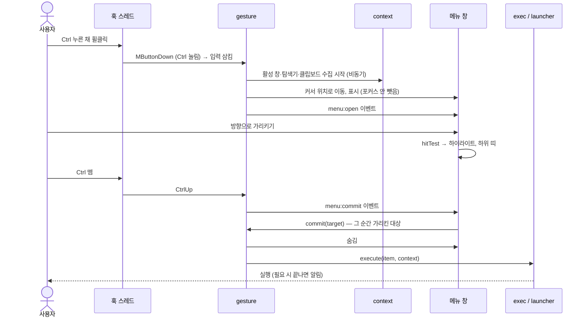

# 아키텍처

> 관련 문서: [입력 방식](interaction.md) · [설정](configuration.md) · [에이전트 연동](agent-integration.md) · [권한 & 보안](elevation-and-security.md) · [로드맵](roadmap.md)

## 1. 무엇을 만드는가

- `Ctrl` + 휠클릭하면 **커서 위치에 2단 원형 메뉴**가 뜬다.
- 상위 칸은 **분류**(앱, 터미널, 폴더·주소, 시스템), 하위 칸은 그 분류에 등록한 **항목**이다.
- `Ctrl`을 누른 채 방향으로 가리키고 **`Ctrl`을 떼면 가리킨 항목을 실행**한다. 자세한 규칙은 [interaction.md](interaction.md).
- 항목은 **항목 추가 창**에서 손으로 넣거나, **에이전트가 `rmctl` CLI 또는 JSON 편집으로** 넣는다.
- 앱은 관리자 권한으로 상주한다. 관리자 창 위에서도 메뉴가 뜨고, 일반 프로그램은 권한을 낮춰 실행한다.

화면 규격은 [`UI_designs/HANDOFF.md`](../UI_designs/HANDOFF.md)를 따른다.

## 2. 기술 스택

| 영역 | 선택 | 이유 |
|---|---|---|
| 앱 셸 | **Tauri 2** | 투명·테두리 없음·항상 위·포커스 안 받는 창 설정 지원, 작은 배포 크기, WebView2는 Windows 기본 탑재 |
| 백엔드 | **Rust** + `windows` 크레이트 | 저수준 훅을 전용 스레드에서 안정적으로 실행, Win32/COM 직접 호출 |
| 메뉴 화면 | **TypeScript (프레임워크 없음)** + SVG + CSS | `menu-standalone.html`, `radial-layout.js`, `tokens.css`를 거의 그대로 이식 |
| 창 화면 (항목 추가, 승인, 설정) | **Svelte 5** + TypeScript | 입력란이 많은 화면을 가볍게 작성 |
| 빌드 | Vite, Cargo workspace | |
| 설정 모델 | Rust `serde` + `schemars` | Rust 타입 하나로 JSON Schema와 TS 타입을 함께 생성 (`ts-rs`) |
| CLI | Rust `clap` (`rmctl.exe`) | 에이전트용. 앱과 같은 설정 코드를 공유 |
| 글꼴 | IBM Plex Sans KR / Mono (파일로 동봉) | 핸드오프 §6. 네트워크에서 받지 않음 |
| 테스트 | `cargo test`, Vitest | 설정 검증·배치 계산·제스처 상태 머신 |

> [!NOTE]
> 개발 PC에는 Node 22가 설치되어 있지만, **Rust 도구(`rustup`, MSVC 빌드 도구)와 PowerShell 7(`pwsh`)은 설치되어 있지 않습니다.** 기본 셸은 Windows PowerShell 5.1(`powershell`)로 둡니다.

## 3. 프로세스와 창



| 창 | 설정 | 비고 |
|---|---|---|
| 메뉴 | 680×680(100% 배율), `transparent`, `decorations: false`, `shadow: false`, `alwaysOnTop`, `skipTaskbar`, `focusable: false`, 시작 시 숨김 | 열 때는 위치만 옮겨 `SW_SHOWNOACTIVATE`. Win32 확장 스타일 `WS_EX_NOACTIVATE \| WS_EX_TOOLWINDOW`를 직접 확인 |
| 항목 추가 | 840×640, 일반 창 (포커스 받음) | 하위 칸 "추가"를 고르면 생성 |
| 승인 | 작은 모달 | 승인되지 않은 관리자 항목 실행 시 ([권한 & 보안](elevation-and-security.md#4-관리자-항목-승인)) |
| 설정 | 일반 창 | 강조색, 시작 시 실행 등 (디자인 미정) |

**CLI가 앱에 직접 말을 걸지 않는다.** `rmctl`은 설정 파일만 고치고, 앱은 파일 변경을 감시해 다시 읽는다. 일반 권한 프로세스가 관리자 앱에 명령을 보내는 통로를 만들지 않기 위해서다.

## 4. 모듈 구조



### 원칙

- **`radial-core`는 UI·Win32에 의존하지 않는다.** 앱과 `rmctl`이 같은 모델·검증·저장 코드를 쓴다. 설정 형식의 기준은 이 크레이트의 Rust 타입 하나다.
- **JSON Schema와 TS 타입은 생성물이다.** `schema/menu.schema.json`, `src/shared/types.gen.ts`는 Rust 타입에서 생성해 커밋한다. 손으로 고치지 않는다.
- **배치 계산은 화면 쪽에만 둔다.** `radial-layout.js`를 `radial-layout.ts`로 옮기고, 판정(`hitTest`)도 화면이 한다. Rust는 "지금 무엇을 가리키는가"를 화면에게 묻는다 ([interaction.md](interaction.md#5-실행-시점의-경합-처리)).
- **모든 프로세스 실행은 `launcher`를 거친다.** 실행기에서 `std::process::Command`를 직접 쓰지 않는다 (테스트로 강제).
- **훅 콜백은 판단만 하고 바로 반환한다.** 일은 채널로 넘긴다. 훅 함수가 제한 시간(최대 1초)을 넘기면 Windows가 훅을 통보 없이 제거한다.

## 5. 디렉터리 구조

```
Radial_menu/
├─ AGENTS.md                      # 에이전트용 안내 (구현 단계에서 작성, agent-integration.md 요약)
├─ README.md
├─ Cargo.toml                     # workspace: src-tauri, crates/*
├─ package.json
├─ vite.config.ts
├─ tsconfig.json
├─ UI_designs/                    # 디자인 핸드오프 원본 (수정하지 않음)
├─ docs/                          # 설계 문서
├─ schema/
│  └─ menu.schema.json            # 생성물: radial-core 모델에서 생성
├─ examples/
│  └─ menu.example.json           # 분류 4종 예시 설정
├─ src/                           # 화면 (TypeScript)
│  ├─ menu/
│  │  ├─ index.html
│  │  ├─ main.ts                  # IPC 수신, 상태, 판정 결과 보고
│  │  ├─ render.ts                # SVG 렌더링 (menu-standalone.html 이식)
│  │  ├─ motion.ts                # 하이라이트 회전, 띠·칸 등장
│  │  └─ radial-layout.ts         # radial-layout.js 이식
│  ├─ dialogs/                    # Svelte
│  │  ├─ add-item/                # 분류별 입력란 (add-item.dc.html 이식)
│  │  ├─ approve/                 # 관리자 항목 승인
│  │  └─ settings/
│  ├─ shared/
│  │  ├─ tokens.css               # UI_designs/tokens/tokens.css 복사
│  │  ├─ icons.ts                 # 24 격자 선 아이콘 SVG
│  │  ├─ ipc.ts                   # invoke / listen 래퍼
│  │  └─ types.gen.ts             # 생성물 (ts-rs)
│  └─ assets/fonts/               # IBM Plex Sans KR, IBM Plex Mono
├─ src-tauri/
│  ├─ Cargo.toml
│  ├─ tauri.conf.json             # 창 정의
│  ├─ capabilities/               # 창별 IPC 권한
│  ├─ app.manifest                # requestedExecutionLevel = asInvoker
│  └─ src/
│     ├─ main.rs
│     ├─ app.rs                   # setup, 상태, 단일 인스턴스, 일반 권한 실행 시 런처 동작
│     ├─ input/
│     │  ├─ hook.rs               # 훅 전용 스레드 + 메시지 루프
│     │  └─ gesture.rs            # Ctrl+휠클릭 상태 머신 (순수 로직, 단위 테스트)
│     ├─ menu_window.rs           # 위치 계산, 표시/숨김, 확장 스타일
│     ├─ context.rs               # 활성 창, 탐색기 현재 폴더·선택 파일, 클립보드
│     ├─ exec/
│     │  ├─ mod.rs                # 분류별 디스패치
│     │  ├─ app.rs                # 실행 / 실행 중이면 창 앞으로
│     │  ├─ terminal.rs           # 새 창 열기, 명령·스크립트 실행
│     │  ├─ folder.rs             # 폴더·주소 열기
│     │  └─ system.rs             # 잠금, 절전, 음소거 등
│     ├─ launcher.rs              # 관리자 실행 / 권한 낮춰 실행
│     ├─ security/approval.rs     # 관리자 항목 승인 저장·확인
│     ├─ config_watch.rs          # 파일 감시, 검증, 마지막 정상 설정 유지
│     ├─ tray.rs
│     ├─ commands.rs              # #[tauri::command] 모음
│     └─ win32/
│        ├─ token.rs              # is_elevated, explorer 토큰 복제
│        ├─ shell.rs              # IShellWindows: 탐색기 폴더/선택
│        ├─ icon.rs               # 프로그램 아이콘 추출
│        ├─ acl.rs                # ProgramData 권한 설정·검사
│        └─ window.rs             # 포그라운드 창, 모니터 작업 영역, DPI
├─ crates/
│  ├─ radial-core/
│  │  └─ src/ model.rs, validate.rs, store.rs, hash.rs, lib.rs
│  └─ rmctl/
│     └─ src/main.rs
├─ scripts/
│  ├─ install.ps1                 # Program Files 복사, ProgramData 권한, 작업 스케줄러 등록
│  ├─ uninstall.ps1
│  ├─ dev-register-task.ps1       # 개발 빌드를 관리자 작업으로 등록
│  └─ gen.ps1                     # 스키마·TS 타입 생성
└─ tests/                         # 통합 테스트 (rmctl 왕복, 설정 감시)
```

## 6. 데이터 흐름: 열기부터 실행까지



- 메뉴 창은 **앱 시작 시 미리 만들어 숨겨 둔다.** 열 때는 위치만 옮기고 보여 준다.
- 메뉴 창이 포커스를 받지 않으므로, 자리표시 `{활성 창 제목}`과 탐색기 선택은 **사용자가 쓰던 창** 기준으로 정확하다.
- 설정은 메뉴 창에 미리 전달해 둔다. 열 때 설정을 읽지 않는다.

## 7. 설정 저장과 다시 읽기

- 앱의 항목 추가 창, `rmctl`, 직접 편집 모두 **같은 파일**(`menu.json`)에 쓴다.
- 쓰기 규칙 (`radial-core::store`)
  1. 잠금 파일(`menu.json.lock`)을 잡는다.
  2. 디스크에서 최신 내용을 다시 읽는다 (다른 쓰기와 충돌 방지).
  3. 고친 결과를 검증한다.
  4. 임시 파일에 쓰고 이름을 바꿔 교체한다 (원자적 쓰기). 직전 내용은 `menu.json.bak`으로 남긴다.
- 앱은 파일 변경을 감시해 다시 읽는다. 검증에 실패하면 **마지막 정상 설정을 유지**하고 트레이 알림으로 오류 위치를 알린다.
