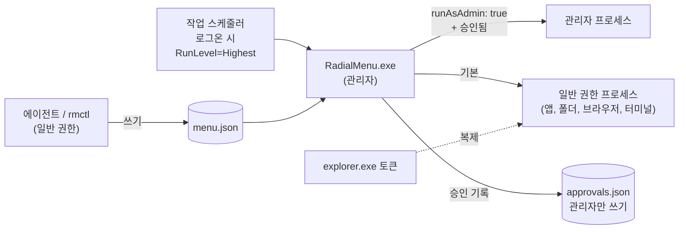
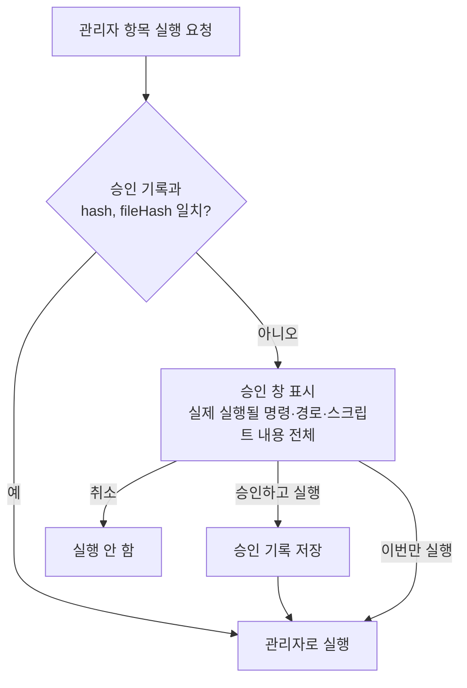

# 권한 & 보안 (전략 B: 관리자 권한 상주)

> 관련 문서: [아키텍처](architecture.md) · [설정](configuration.md) · [에이전트 연동](agent-integration.md)

## 1. 전략 선택 배경

| 전략 | UAC 프롬프트 | 비고 |
|---|---|---|
| A. 항목마다 `runas` | 매번 | 관리자 창이 앞에 있으면 일반 권한 훅이 입력을 못 받음 (UIPI) |
| **B. 앱 전체 관리자 상주** | 없음 | **채택.** 관리자 창 위에서도 Ctrl+휠클릭 동작 |
| C. 관리자 브로커 | 없음 | UIPI 문제 남음, 보안 프로토콜 부담 |

B의 위험과 대응:

| 위험 | 대응 |
|---|---|
| 앱이 실행하는 모든 프로그램이 관리자 권한을 물려받음 | **권한 낮춰 실행** (§3) |
| 사용자 권한으로 고칠 수 있는 `menu.json`의 관리자 항목을 관리자 앱이 실행 → UAC 우회 | **관리자 항목 승인** (§4) |
| 관리자 앱이 사용자 권한 위치의 코드를 불러옴 | **Program Files 설치**, 화면 자원은 실행 파일에 내장 (§5) |

> [!NOTE]
> Microsoft는 UAC를 보안 경계로 보지 않습니다. 개인 PC 단일 사용자 기준으로 B는 실용적인 선택입니다. 다만 에이전트가 설정을 고칠 수 있게 하면서 "에이전트가 쓴 명령이 승인 없이 관리자로 실행되는 일"은 막아야 하므로 §4의 승인 절차를 둡니다.

## 2. 실행 구조



## 3. 권한 낮춰 실행 (`src-tauri/src/launcher.rs`)

```rust
launcher.spawn(spec, Elevation::User | Elevation::Admin)
```

| 요청 | 앱이 관리자일 때 | 앱이 일반 권한일 때 (개발·폴백) |
|---|---|---|
| `Admin` | `CreateProcessW` 직접 (권한 상속, 출력 캡처 가능) | `ShellExecuteExW("runas")` → UAC |
| `User` | **explorer 토큰 복제 후 실행** | `CreateProcessW` 직접 |

### 권한 낮추기 절차 (`win32/token.rs`)

1. `GetShellWindow()` → `GetWindowThreadProcessId()`로 explorer PID를 얻는다.
2. `OpenProcess(PROCESS_QUERY_LIMITED_INFORMATION)` → `OpenProcessToken(TOKEN_DUPLICATE | TOKEN_QUERY | TOKEN_ASSIGN_PRIMARY)`
3. `DuplicateTokenEx(..., TokenPrimary)`
4. `CreateEnvironmentBlock(token)` 후 `CreateProcessWithTokenW(token, ...)`
5. 실패하면 explorer의 `IShellDispatch2::ShellExecute`(COM)로 다시 시도한다.
6. 둘 다 실패하면 (explorer가 안 떠 있는 등) **실행을 거부하고 알린다.** 관리자 권한으로 조용히 실행하지 않는다.

폴더·주소 열기, URL 열기, 앱 실행, 일반 터미널 모두 이 경로를 쓴다. 기본 브라우저가 관리자로 뜨지 않는다.

### 실행 경로 강제

- 실행기(`exec/*`)에서 `std::process::Command`, `ShellExecuteW`를 직접 쓰지 않는다. `launcher`만 쓴다.
- 이 규칙은 테스트로 확인한다 (소스에서 금지된 호출을 찾는 테스트).

## 4. 관리자 항목 승인

`menu.json`은 사용자 권한으로 고칠 수 있다 (에이전트 연동을 위해). 그래서 **`runAsAdmin: true` 항목은 사용자가 승인한 내용과 똑같을 때만** 관리자로 실행한다.

### 승인 기록

`%ProgramData%\RadialMenu\approvals.json` — 관리자만 쓸 수 있다 (§5). 앱만 쓴다.

```json
{ "version": 1, "approvals": [
  { "itemId": "flushdns", "hash": "sha256:…", "fileHash": null, "approvedAt": "2026-10-05T13:30:00+09:00" }
] }
```

- `hash`: 항목의 **실행에 영향을 주는 필드**(`path`, `args`, `action`, `mode`, `command`, `file`, `shell`, `workDir`, `startDir`, `window`, `runAsAdmin` 등)를 정규화한 JSON의 SHA-256. `label`, `icon`처럼 실행과 무관한 필드를 바꿔도 승인은 유지된다.
- `fileHash`: `mode: "file"`이면 스크립트 파일 내용의 SHA-256. 실행 직전에 다시 계산한다.

### 흐름



- **항목 추가 창에서 사용자가 직접 만든 관리자 항목**은 저장할 때 승인 기록을 함께 남긴다 (사용자가 관리자 앱의 창에서 직접 눌렀으므로).
- **`rmctl`이나 직접 편집으로 들어온 관리자 항목**은 처음 실행할 때 승인 창이 뜬다. 메뉴의 해당 칸에는 "승인 필요" 표시를 한다.
- 승인 창은 관리자 앱의 창이다. 일반 권한 프로그램은 UIPI 때문에 이 창에 키 입력이나 클릭을 보낼 수 없다. **에이전트가 대신 승인할 수 없다.**
- 승인 창의 버튼은 창이 뜬 뒤 0.5초 동안 눌리지 않게 한다 (Ctrl을 떼는 순간 실수로 눌리는 것 방지).
- 앱이 일반 권한으로 도는 개발 모드에서는 UAC 프롬프트가 승인 역할을 하므로 승인 기록을 쓰지 않는다.

### 자리표시와 관리자 항목

관리자 명령에 `{클립보드}`처럼 다른 프로그램이 바꿀 수 있는 값이 들어가므로, 자리표시는 문자열에 이어 붙이지 않고 **환경 변수로 넘긴다** ([설정 §5](configuration.md#5-자리표시)). 승인된 명령의 구조는 그대로이고 값만 데이터로 들어간다.

## 5. 파일 위치와 권한

| 경로 | 권한 | 내용 |
|---|---|---|
| `C:\Program Files\RadialMenu\` | 관리자만 쓰기 (Windows 기본) | `RadialMenu.exe`, `rmctl.exe`, 스키마. 화면 자원(HTML/JS/CSS/글꼴)은 실행 파일에 내장 |
| `C:\ProgramData\RadialMenu\` | `SYSTEM`·`Administrators` 모든 권한, `Users` 읽기. 상속 끊음 | `approvals.json` |
| `%APPDATA%\RadialMenu\` | 사용자 | `menu.json`, `menu.json.bak`, 로그 |
| `%LOCALAPPDATA%\RadialMenu\WebView2\` | 사용자 | WebView2 사용자 데이터 (캐시). 화면 코드는 여기서 읽지 않음 |

- 앱은 시작할 때와 승인 기록을 읽을 때 `ProgramData\RadialMenu`의 권한을 검사한다. 일반 사용자가 쓸 수 있게 바뀌어 있으면 **관리자 항목 실행을 모두 막고** 트레이로 경고한다.
- `mode: "file"` 스크립트는 사용자 폴더에 있어도 된다. 내용이 바뀌면 `fileHash`가 달라져 다시 승인을 받는다.

## 6. 설치와 시작

### 매니페스트
- `RadialMenu.exe`는 `asInvoker`. 관리자 권한은 작업 스케줄러가 준다.

### `scripts/install.ps1` (관리자로 한 번 실행)
1. `C:\Program Files\RadialMenu\`에 빌드 결과를 복사하고 PATH에 추가한다 (`rmctl`용).
2. `C:\ProgramData\RadialMenu\`를 만들고 권한을 설정한다.
3. `%APPDATA%\RadialMenu\menu.json`이 없으면 예시 설정을 복사한다.
4. 작업 스케줄러에 등록한다.
   - 트리거: 현재 사용자 로그온
   - `RunLevel Highest`, `LogonType Interactive`
   - 실행 시간 제한 없음, 배터리 사용 시 중지 안 함

### 일반 권한으로 실행됐을 때 (`app.rs`)
- 사용자가 exe를 더블클릭해 일반 권한으로 뜨면 → `schtasks /run /tn RadialMenu`로 작업을 실행해 관리자 인스턴스를 띄우고 자신은 끝낸다 (UAC 없음).
- 작업이 등록되어 있지 않으면 일반 권한 모드로 계속 돈다. 관리자 항목은 `runas`로 실행한다.

### 단일 인스턴스
- 이름 있는 뮤텍스 `Local\RadialMenu`. 두 번째 인스턴스는 바로 끝낸다.

### 개발 모드
- `scripts/dev-register-task.ps1`로 개발 빌드를 관리자 작업으로 등록해 B 모드를 시험한다.
- 개발 빌드는 레포 폴더(사용자 쓰기 가능)에서 돌므로 §5의 보호가 적용되지 않는다. 트레이에 `DEV` 표시를 한다.
