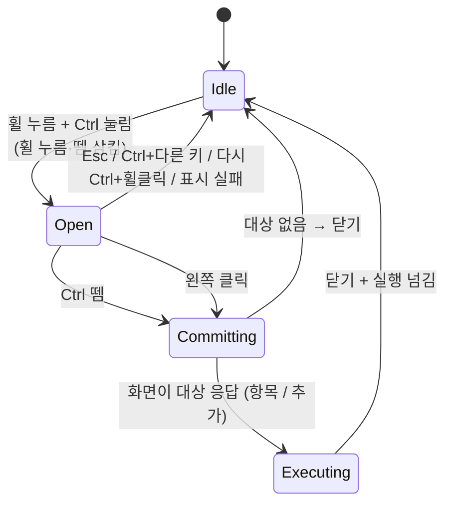

# 입력 방식: Ctrl + 휠클릭

> 관련 문서: [아키텍처](architecture.md) · [디자인 핸드오프 §4](../UI_designs/HANDOFF.md)

## 1. 동작 요약

1. **`Ctrl`을 누른 채 휠 버튼을 클릭**하면 커서 위치에 메뉴가 뜬다.
2. `Ctrl`을 계속 누른 채 마우스를 움직여 분류 → 항목을 가리킨다.
3. **`Ctrl`을 떼면** 그 순간 가리킨 항목을 실행하고 메뉴를 닫는다.

| `Ctrl`을 뗀 순간 가리킨 대상 | 결과 |
|---|---|
| 하위 칸의 항목 | **실행** |
| 하위 칸의 "추가" | 메뉴를 닫고 항목 추가 창을 연다 |
| 상위 칸(분류)만 가리킴, 하위 칸 없음 | 아무것도 하지 않고 닫는다 |
| 상위 빈칸의 "분류 추가" | 메뉴를 닫고 분류 추가 화면을 연다 (디자인 미정) |
| 가운데 닫기 버튼 / 아무것도 안 가리킴 | 아무것도 하지 않고 닫는다 |

**그 밖의 조작**

| 조작 | 결과 |
|---|---|
| 메뉴가 열린 동안 왼쪽 클릭 | 클릭한 대상을 바로 실행 (위 표와 같은 규칙). 이후 `Ctrl`을 떼도 아무 일 없음 |
| `Esc` | 취소하고 닫는다 |
| `Ctrl`을 누른 채 다른 키 (예: `C`) | 취소하고 닫는다. 그 키 입력은 원래 프로그램에 그대로 전달 |
| 메뉴가 열린 동안 휠 굴리기 | 입력을 삼킨다 (뒤 프로그램의 `Ctrl`+휠 확대/축소 방지) |
| 열린 상태에서 다시 `Ctrl` + 휠클릭 | 닫는다 |
| `Ctrl` 없이 휠클릭 | **가로채지 않는다.** 원래 휠클릭(새 탭에서 열기 등)이 그대로 동작 |

> [!NOTE]
> **핸드오프와 다른 점**: 핸드오프는 "휠 버튼 단독"으로 열고 클릭으로 실행하는 시안이었습니다. 이 앱은 `Ctrl` + 휠클릭으로 열고 `Ctrl`을 떼면 실행합니다. 그래서 핸드오프 §8의 "짧게 누른 휠클릭을 살릴지"와 "누른 채 밀고 떼면 실행"은 이 방식으로 정해졌습니다.

## 2. 상태 머신 (`src-tauri/src/input/gesture.rs`)

- 상태 머신은 **순수 로직**으로 작성한다. 입력 이벤트를 받아 "삼킬지 여부"와 "할 일 목록"을 돌려준다. 훅이나 창 없이 단위 테스트한다.
- `Ctrl`은 왼쪽·오른쪽 모두 인정한다. `Ctrl` 상태는 키보드 훅에서 직접 추적한다 (`GetAsyncKeyState`에 의존하지 않음).

## 3. 훅 (`src-tauri/src/input/hook.rs`)

| 훅 | 보는 입력 | 삼키는 경우 |
|---|---|---|
| `WH_MOUSE_LL` | 휠 누름/뗌, 휠 굴림, 왼쪽 클릭, 이동 | `Ctrl` 눌린 상태의 휠 누름과 **짝이 되는 휠 뗌**, 열린 동안의 휠 굴림 |
| `WH_KEYBOARD_LL` | `Ctrl`, `Esc`, 그 밖의 키 | 열린 동안의 `Esc`. **`Ctrl` 뗌은 삼키지 않는다** (키 상태가 꼬이지 않게) |

- 두 훅 모두 **전용 스레드 하나**에서 걸고, 그 스레드가 메시지 루프를 돈다.
- 콜백은 상태를 보고 삼킬지 결정한 뒤 즉시 반환한다. 할 일은 채널로 코어 스레드에 넘긴다.
- 휠 누름을 삼켰으면 그에 짝이 되는 휠 뗌도 반드시 삼킨다. 짝이 안 맞으면 뒤 프로그램이 "눌린 채"로 착각한다.
- 앱이 관리자 권한이므로 **관리자 권한 창이 앞에 있어도** 훅이 입력을 받는다 (핸드오프 §9.4의 4번). UAC 보안 데스크톱과 잠금 화면은 예외.

## 4. 판정 규칙

판정은 메뉴 창의 화면 코드가 `radial-layout.ts`의 `hitTest`로 한다. 반지름 영역은 핸드오프 §4.1의 치수를 쓴다.

| 커서 위치 (메뉴 중심 기준 반지름 r) | 판정 |
|---|---|
| r < 38 (가운데) | 대상 없음 (닫기 버튼) |
| 38 ≤ r ≤ 186 (상위 링) | 각도로 **분류를 고른다.** 분류가 바뀌면 하위 띠가 그쪽으로 다시 펼쳐짐 |
| r > 186 (하위 띠와 그 바깥) | **분류는 바꾸지 않는다.** 현재 띠 안에서 각도로 하위 칸을 고른다. 띠의 각도 범위 밖이면 하위 칸 없음 |

- 하위 띠는 최대 220도까지 펼쳐져 다른 분류 방향과 겹친다. 그래서 **바깥쪽에서는 분류를 바꾸지 않는 것**이 핵심 규칙이다. 분류를 바꾸려면 상위 링 안으로 돌아온다.
- 커서가 메뉴 창(680×680) 밖으로 나가도 판정을 계속한다. 메뉴가 열린 동안 마우스 훅이 커서 좌표를 화면에 전달한다 (프레임당 한 번으로 묶어서).
- 상위 빈칸(첫 칸 제외)은 반응하지 않는다 (핸드오프 §4.3).

## 5. 실행 시점의 경합 처리

`Ctrl`을 뗀 순간과 화면이 마지막으로 판정한 순간이 어긋나지 않게 **화면에게 묻는 방식**을 쓴다.

1. 훅이 `Ctrl` 뗌을 보고 코어에 알린다.
2. 코어가 메뉴 창에 `menu:commit` 이벤트를 보낸다.
3. 화면은 들어온 순서대로 이벤트를 처리하므로, 직전 커서 이동까지 반영한 대상을 `commit(target)`으로 응답한다.
4. 코어는 응답을 받으면 메뉴를 숨기고 실행을 넘긴다. 200ms 안에 응답이 없으면 실행하지 않고 닫는다.

## 6. 메뉴 위치

- 메뉴 중심 = 커서 위치. 창(680×680)의 중심을 커서에 맞춘다.
- 커서가 화면 가장자리에 있으면, 하위 띠 바깥 반지름(278)까지 모니터 작업 영역 안에 들어오도록 **중심을 안쪽으로 옮긴다.** 이때 커서는 중심에서 벗어나므로, 판정은 옮겨진 중심 기준으로 한다.
- 길이는 100% 배율 기준이다. 커서가 있는 모니터의 배율을 곱한다 (Per-Monitor DPI v2).

## 7. 충돌과 예외

| 상황 | 처리 |
|---|---|
| 브라우저의 `Ctrl` + 휠클릭 (링크를 백그라운드 탭으로 열기) | 이 앱이 가져간다. 필요하면 **제외할 프로그램 목록**으로 해당 프로그램에서만 가로채지 않게 한다 (Phase 6) |
| 전체 화면 게임 | 전체 화면 프로그램이 앞에 있으면 가로채지 않는 옵션 (Phase 6) |
| 메뉴 표시 전에 `Ctrl`을 뗌 | 메뉴를 띄우지 않는다 |
| 훅이 Windows에 의해 제거됨 | 주기적으로 훅 상태를 확인하고 다시 건다. 트레이에 상태 표시 |
